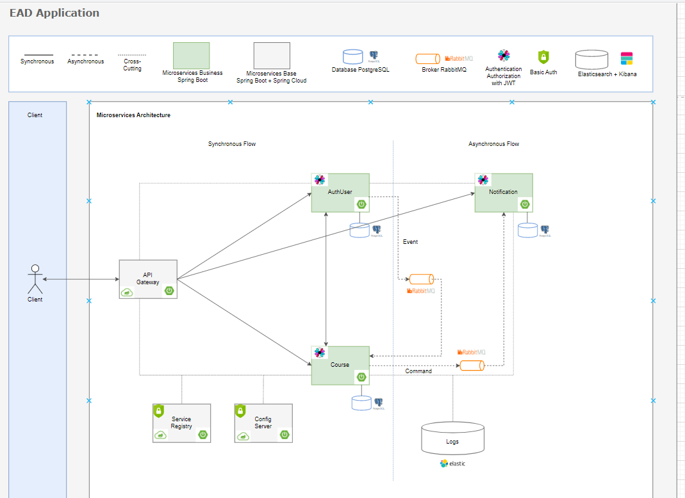

# EAD - CONFIG SERVICE REPOSITORY

## Sobre o projeto
Projeto Decoder EAD - Arquitetura de microservices, tem como maior
objetivo colocar em prática todos os conceitos abordados.

Cada funcionalidade da plataforma é abordada como um serviço independente, promovendo flexibilidade e isolamento de responsabilidades.

### Alguns dos conceitos abordados ao longo do projeto
`Shared Database Pattern`
`Event Driven Pattern`
`Comunicação por Coreografia`
`Authentication e Authorization com JWT`
`Observability`
`SAGA Pattern`
`Cross
Cutting`
`Event Carried State Transfer Pattern`

### Desenho da solução

## Sobre a API
Implementação do padrão Config Service (Serviço de configuração), tem como objetivo ser o repositório das configurações de ambiente de todos os microservices que compõem o projeto EAD.

### Autor
Aline Soares da Paz

https://www.linkedin.com/in/alinepazz/
